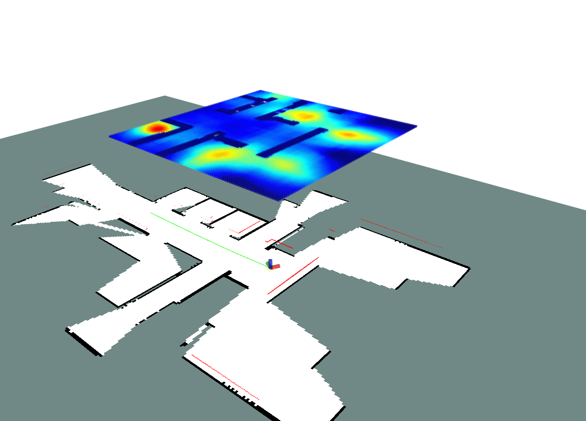

# Information map
It's a ROS package that generates the information map for autonomous exploration and navigation. It uses occupancy girds as a map representation.The package just has 1 ROS nodes:

  - Information map generator node.

This is a [Youtube playlist](https://youtu.be/AcaPfC4WGOs) showing the package running online, using simulation (Gazebo).


## 1. Requirements
The package has been tested on ROS Noetic. The following requirements are needed before installing the package:

1- You should have installed a ROS distribution (Noetic or later. Recommended is Noetic). Note that you need ensure all python dependencies of ROS in Python 3.x.

2- If you want to run our demo, you need to install PyTorch 1.7.x or later. We run our demo with PyTorch 1.8.2+CUDA 11.4

2- Created a workspace.

3- Installed the "gmapping" and "move_base" ROS package: on Ubuntu20.04, you can do that by typing the following command in the terminal:

```sh
$ sudo apt-get install ros-noetic-gmapping ros-noetic-move-base*
```

6-You should have/install the following python modules:

-OpenCV (cv2)

```sh
$ sudo apt-get install python-opencv
```
-Numpy

```sh
$ sudo apt-get install python-numpy
```

## 2. Installation
Download the package and place it inside the ```/src``` folder in your workspace. And then compile using ```catkin_make```. In Ubuntu, you can follow the command in terminal:
```sh
$ cd src
$ catkin_make
```

## 3. Run Demo:
### 3.1 Step in your workspace
### 3.2  
```sh
$ bash test.sh
```
### 3.3 Subscribe and Publish ROS Topic

- **Subscribe**: "*map*" raw occupancy grid map, frequency less than 1Hz

- **Publish**: 

  "*information_map*" --- occupancy grid map

  "*local_map*" --- occupancy grid map

  "*vis_infomap*" --- pointcloud2

### 3.3 Outcome


Top -> Bottom: information map(pointcloud) --> information map(occupied map) --> local map

## 4. Dataset
The dataset contains 5000 training sets and 2000 testing sets. All datas are stored as numpy array(.npy), size: 100X100, 0.1 m/cell. The dataset is under the assumption: lidar maximum scan range is 5 m.


## 5. Network
If you want to use own trained dataset, you can replace our network model with your model(.pth). The model and network structure is defined:
```sh
$ src/information_map/scripts/nn_model/best_model_params.pth
```
```sh
$ src/information_map/scripts/network.py
```

## 6. Paper & Video

```sh
$ Paper coming soon
```
- **Video**: 

  https://youtu.be/AcaPfC4WGOs

  


